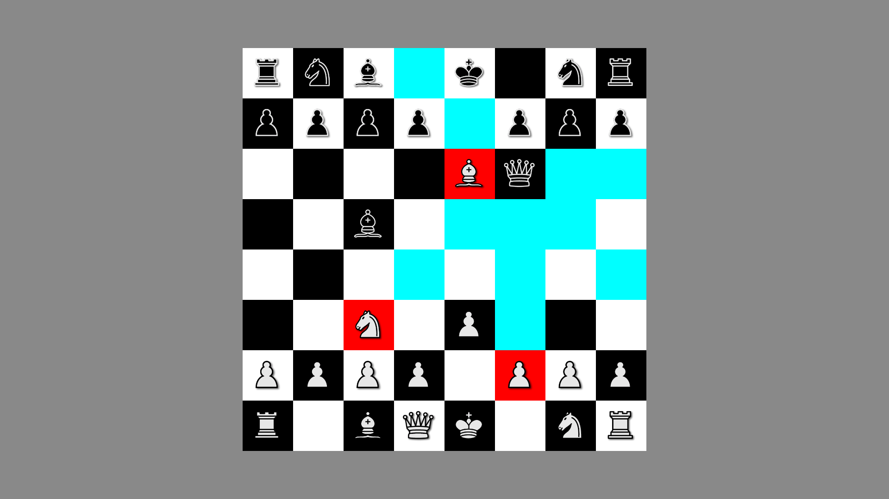

# Chess2D
Welcome to the 2D Chess Game developed in Unity! This project is still in progress.

## Introduction
This Unity project is a simple 2D chess game designed to provide a fun and engaging chess-playing experience. It allows two players to play a standard game of chess on a 2D board.

## Features
### - **2D Chess Board**: Play chess on a 2D board with a classic black and white design.
### - **Two-Player Mode**: Enjoy a chess match with a friend on the same device.
### - **Legal Moves Highlighting**: Legal moves for each piece are highlighted for the player.
### - **Castling**: Highlights and allows castling during gameplay.
### - **Win/Lose/Draw**: Calculates and displays the winner when the game ends.

